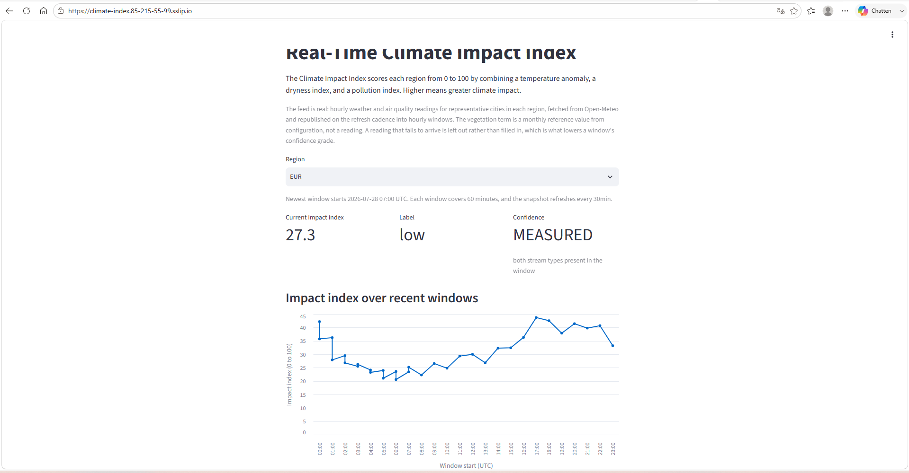
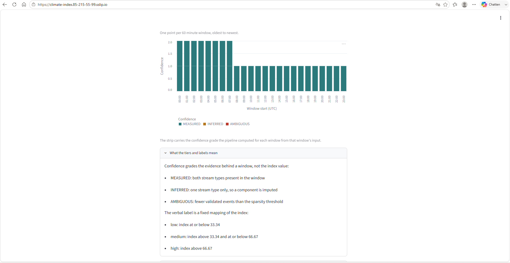

# I pointed my pipeline at a dead host, and it downgraded itself

Most streaming demos show a number moving on a chart and ask you to trust it. I built the opposite: a pipeline where every number carries a confidence grade computed from how much clean evidence actually backed it. The only real test of a grade like that is what happens when the evidence disappears for real.

So on 22 July I pointed the pipeline's air quality endpoint at a hostname that does not exist and ran a full tick against the live weather source.

```
{"city":"Amsterdam","event":"source_reading_unavailable","reason":"transport_error","region":"EUR","stream":"satellite"}
{"city":"Berlin",   "event":"source_reading_unavailable","reason":"transport_error","region":"EUR","stream":"satellite"}
...one per city, twelve in all...
{"component":"at12","emitted":12,"event":"source_tick_complete","regions":4,"unavailable":12}
{"component":"at12","consumed":12,"event":"processor_run_complete","forwarded":12,"quarantined":0,"records":4}

EUR 2026-07-22 13:00 .. 13:30  index=41.87 anomaly= 2.97 dry=1.000 poll=0.000 confidence=INFERRED
NAM 2026-07-22 13:00 .. 13:30  index=30.00 anomaly=-3.13 dry=1.000 poll=0.000 confidence=INFERRED
AFR 2026-07-22 13:00 .. 13:30  index=57.97 anomaly= 7.07 dry=0.990 poll=0.000 confidence=INFERRED
ASI 2026-07-22 13:00 .. 13:30  index=37.60 anomaly= 1.90 dry=1.000 poll=0.000 confidence=INFERRED
```

Twelve fetches failed, one per city. The producer counted each skip and published the twelve weather readings it did get. The processor aggregated them, and the committed grader dropped every region from MEASURED to INFERRED on its own. Nothing in the codebase sets a grade by hand, no retry papered over the gap, and no missing reading was substituted. Half the evidence was gone, and the system said so.

Here is the clean run from the same afternoon for comparison:

```
{"component":"at12","emitted":24,"event":"source_tick_complete","regions":4,"unavailable":0}
{"component":"at12","consumed":24,"event":"processor_run_complete","forwarded":24,"quarantined":0,"records":4}

EUR 2026-07-22 13:00 .. 13:30  index=44.99 anomaly= 2.97 dry=0.605 poll=0.499 confidence=MEASURED
NAM 2026-07-22 13:00 .. 13:30  index=31.37 anomaly=-3.13 dry=0.605 poll=0.441 confidence=MEASURED
```

Look at the temperature anomaly. EUR reads +2.97 in both runs, NAM reads -3.13 in both. Only the pollution stream went dark, and because each city's two streams travel in separate requests, the failure stayed contained to the stream that actually failed. The weather half of the index never noticed.

## What the system is

The Real-Time Climate Impact Index reads live weather and air quality data for twelve cities across four regions, publishes the readings to a single-node Kafka broker, validates each event and quarantines the ones that fail, aggregates the survivors into 30-minute event-time windows keyed by a natural identity, computes a 0-to-100 index plus its confidence grade per region, and serves the result from a read-only Streamlit dashboard.

One config flag selects the storage backend: DuckDB and local files on a laptop, or an Iceberg table cataloged in Glue on S3 plus DynamoDB on AWS. The core processing code contains no cloud SDK at all, and a test invariant fails the build if one appears. A second flag selects the event source the same way: `real` fetches from Open-Meteo, `simulated` runs deterministic generators so the 253-test suite stays offline.

Repo: [github.com/rkendev/real-time-climate-impact-index](https://github.com/rkendev/real-time-climate-impact-index). Live demo: [climate-index.85-215-55-99.sslip.io](https://climate-index.85-215-55-99.sslip.io), refreshing itself every thirty minutes.



*One region's current index, its label, and the confidence grade the pipeline computed for the newest window. The screenshots come from the hosted demo, which runs `CII_WINDOW_MINUTES=60` (`deploy/vps/demo.env.example`), while the narrative here describes a local run at the `window_minutes = 30` default (`src/climate_index/config.py`): the window size is configuration, not something baked into the pipeline.*

## The grade was decoration until the data was real

The pipeline was built simulated-first, and that was the right call for everything except the confidence grade. On a generated feed, nothing can fail to arrive. Every window came out MEASURED, and the demo had to deliberately thin some windows for the grader to have anything to say. The grade worked, in the sense that the code paths ran, and meant nothing, in the sense that the conditions it grades could never occur naturally.

Swapping in the real source changed that. A timed-out request is a real gap. A null field in the response is a real gap. The dead-host run above is the controlled version of the experiment, and it is the moment the grade stopped being decoration: real absence, detected by committed code, reflected in the output, with no hand on the scale.



*The confidence strip: one band per window, coloured by the grade computed from that window's own input (teal MEASURED, amber INFERRED, red AMBIGUOUS). A thin window is flagged, never hidden.*

## Replay runs in production, not just in a test

Every window row is keyed by a natural identity (region plus window start), so reprocessing the same data must update the same row instead of duplicating it. The test suite proves this, and so does a paid cloud check I will get to below. What I like more is that the live demo now proves it continuously: each refresh fetches and republishes the last 38 hours of real hourly readings, 912 events in all, through the full Kafka path. Two consecutive refreshes each pushed all 912 events, and the published snapshot held 152 rows both times, not 304. The property the key was designed for gets exercised every thirty minutes in public.

## What verification kept catching

Three findings from the real-data phase, each caught by checks rather than by luck.

**Open-Meteo returns naive timestamps.** Even with `timezone=UTC` in the request, the hourly timestamps come back as naive ISO strings with no offset. Attaching UTC blindly would be a silent corruption waiting for a config change. The adapter instead asserts the declared offset is zero before attaching UTC, so if the provider's behavior ever shifts, the pipeline fails loudly at the boundary instead of aggregating shifted windows.

**A test fixture had been leaking for months.** When Terraform 1.14.8 arrived, it began validating AWS credentials against STS, and two pre-deploy gate tests started failing, in one test order and not another. Bisecting the order dependence traced it to a session-scoped autouse fixture that set fake AWS credentials for the offline AWS tests and never unset them, poisoning every later test that shelled out with the inherited environment. The fix moved the mutation to function-scoped setenv, and a standing guard test now fails if fake credentials survive past the package that sets them. I proved the guard works by restoring the old fixture from git and watching it fail, naming the leaked variables.

**A hygiene gate was checking the wrong tree.** The build-hygiene checks walked the raw filesystem, so an untracked scratch file on one machine could red the suite while CI stayed green. The gate now walks the tracked tree only, and it was proven sensitive the same way: seed a violation in a tracked file, watch it fail; leave one in an untracked file, watch it pass.

## The cloud gate cost five cents

Everything provable offline was proven offline first: 253 tests green under strict mypy, the AWS adapters exercised against moto, Terraform formatted, validated, and planned with no credentials. Then one bounded paid window in us-east-1, about forty minutes on a single Graviton instance, against a 50 dollar ceiling with a 12 dollar budget alarm confirmed live before any compute started.

That single window caught four defects that only exist against real AWS: the Glue database needed an explicit catalog id, the Terraform provider needed a switch to stop skipping account resolution on a real apply, the Iceberg Glue client needed the region present in the box environment, and the processor role needed one more Glue permission because the client creates its namespace idempotently. None of these are visible offline. All four are fixed and committed.

The run also proved the two properties moto physically cannot exercise: replaying one window against the real Glue-cataloged Iceberg table left exactly one row for that key, and DynamoDB reads measured a p95 of 130 ms over fifty reads, across the public internet, against a one-second requirement. Then everything billable was destroyed, and a tag-based audit confirmed nothing billable still carried the project tag. Total spend came in under five cents.

## The CI decision that was never made

Wiring up CI at the end produced the strangest finding of the project. I went looking for the recorded decision to skip CI during the build and found that no such decision existed. The docs had specified a CI step all along, and a local script had quietly satisfied it, unrecorded. So the CI decision record documents an unrecorded substitution, and its correction. The workflow itself runs the exact make targets a developer runs locally, needs zero repository secrets, pins every action to a full commit SHA, and includes a weekly scheduled run, because a finished repository gets no pushes and a dormant one is where toolchain drift accumulates unseen. The fixture leak above is precisely the class of failure that run is there to catch.

## What this project claims

A confidence grade you can trust is a systems property. It took a real source that can fail, a grader that no code path can override, containment that keeps one stream's outage out of the other's numbers, and idempotent replay so that re-fetching reality never double-counts it. Each of those is a small, testable decision. The dead-host run is what they add up to.

The spec, the decision records, and the runbook with the full log excerpts are in the repo, written to be read in order.
